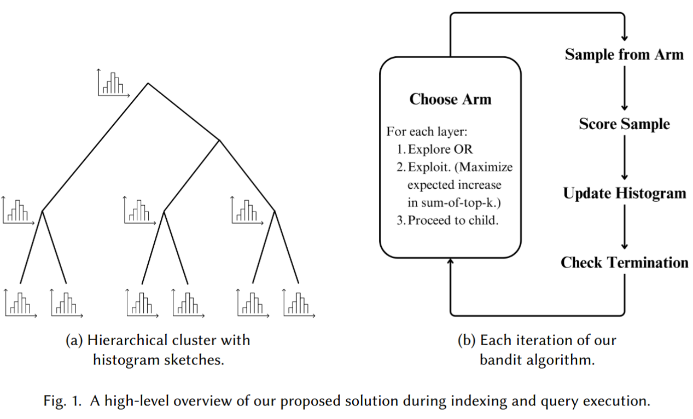
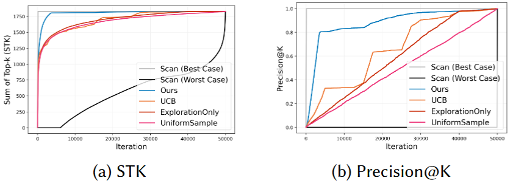
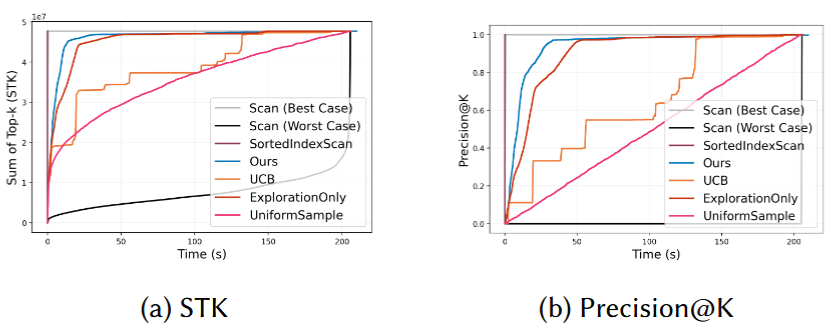
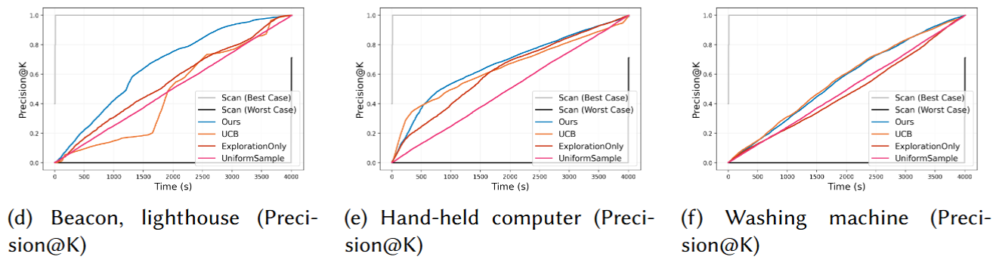

# Approximating Opaque Top-k Queries

This repository contains experimental code for the SIGMOD 2025 paper [*Approximating Opaque Top-k Queries*](https://dl.acm.org/doi/abs/10.1145/3725266) by Jiwon Chang and Fatemeh Nargesian. 

## Paper Summary

We present a novel bandit algorithm for approximating opaque top-k queries, where the scoring function is given by expensive black-box UDFs like ML models. 

For example:

- `SELECT * FROM used_cars ORDER BY predict_sale_price(*) LIMIT k;`
- `SELECT * FROM images ORDER BY image_has_object(image, 'computer') LIMIT k;`

We leverage two key ideas. 

1. **Fast query-agnostic index building:** Build a tree index that captures a *generic* notion of similarity between elements in the dataset. (VOODOO index by Wenjia He et al. 2020)
2. **Adaptive query execution:** Apply an $\varepsilon$-greedy bandit strategy. Learn, in query time, the distribution of scores in branches of the index. Then, prioritize branches that maximize the expected marginal gain in Sum-of-Top-K scores (STK). (STK is similar to cumulative gain in IR.) 

## Key Results

We show that our algorithm out-performs baseline AQP algorithms such as UCB, non-adaptive sampling strategies, and linear scan, in three settings: 1) synthetic Gaussian data, 2) tabular regression using XGBoost ($n = 100,000$), 3) image fuzzy classification using ResNet ($n = 320,000$). Here, Sum-of-Top-k (STK) is roughly equivalent to cumulative gain. 

**Synthetic Gaussian distributed data:**

**Tabular regression:**

**Image fuzzy classification:**

Our method reduces the end-to-end latency (index building + query latency) to achieve a near-optimal precision. The algorithm overhead is negligible compared to UDF latencies for both decision-tree based models and DNNs, and fallback strategies improve empirical performance. 

## Reproducibility

Our results in the paper were obtained via a standalone implementation of our algorithm and baselines in Python. 

We provide detailed reproducibility instructions in `src/reproducibility/reproducibility.md`. Most steps of the reproducibility is automated, but some manual work is required to acquire the datasets.
1. To obtain the US Used Cars data for tabular regression experiments, a Kaggle account is needed. 
2. ImageNet-1k should be obtained on the dataset website at https://www.image-net.org/.

The experiments are configured as JSON files that list a collection of configurations to run and compare. There are also "fast" versions of each UDF that uses precomputed values. This gives accurate per-iteration result much faster than computing the UDFs on the fly. 